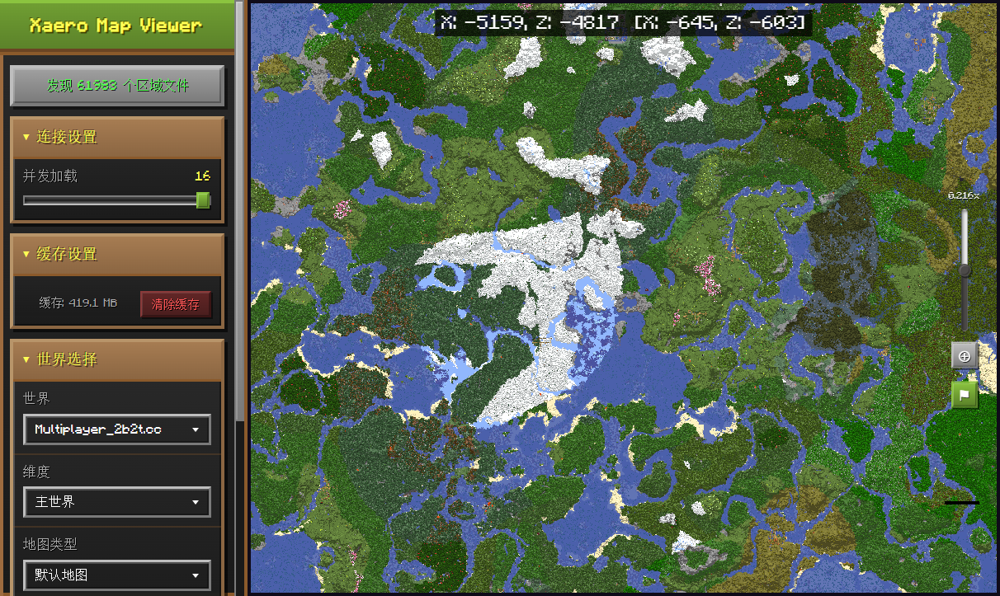

# Xaro 地图预览器

<p align="center">
  
</p>

一个基于 Web 的 Xaero's World Map 数据查看器，可以在浏览器中流畅浏览和查看 Minecraft 的 Xaero 地图数据。

## ✨ 功能特性

### 🗺️ 地图浏览
- **流畅交互** — 支持缩放、平移浏览 Xaero's World Map 生成的地图数据
- **多维度支持** — 主世界、下界、末地三个维度一键切换
- **洞穴模式** — 支持分层和完整两种洞穴渲染模式，可调节 Y 高度
- **坐标跳转** — 输入坐标快速定位到地图上的任意位置
- **维度换算** — 右键菜单支持主世界/下界坐标换算与快速跳转（8:1 比例）

### 📍 路径点管理
- 读取并显示 Xaero's Minimap 的路径点数据
- 支持搜索、筛选和快速跳转

### ⚡ 性能优化
- **LOD 渲染** — 多级细节渲染，远处区域自动降级，空闲时逐步升级画质
- **双层缓存** — 基于 SQLite 的内存 LRU + 磁盘持久化缓存，避免重复解析
- **多线程解析** — Worker 线程池并行解析区域文件，充分利用多核 CPU
- **WebSocket 通信** — 前后端二进制数据传输，高效低延迟
- **WebGL 渲染** — 纹理图集渲染，支持大规模地图数据流畅显示

### 🎮 Minecraft 风格
- 使用 Minecraft 字体和风格的界面设计

## 🛠️ 技术栈

| 层级 | 技术 |
|------|------|
| 前端 | TypeScript, Vite, WebGL, WebSocket |
| 后端 | Node.js, Express, WebSocket (ws) |
| 数据解析 | JSZip, fflate, Worker Threads |
| 缓存 | better-sqlite3, LRU Cache |
| 渲染 | Canvas, WebGL 着色器 |

## 📋 环境要求

- **Node.js** >= 18
- **npm** >= 8
- 支持 WebGL 的现代浏览器

## 🚀 快速开始

### 一键安装（推荐）

在 PowerShell 中运行：

```powershell
.\setup.ps1
```

安装脚本会自动完成以下步骤：
1. 检查 Node.js 环境
2. 安装项目依赖
3. 引导配置服务器参数（地图目录、缓存目录、端口等）
4. 构建前端项目
5. 创建启动脚本

### 手动安装

```bash
# 安装依赖
npm install

# 配置服务器参数
# 编辑 server/server_config.json，设置 mapDirectory 为你的 Xaero 地图数据目录

# 构建前端
npm run build

# 启动生产服务器
npm start
```

## 💻 使用方式

双击 `启动.bat` 或运行：

```bash
npm start
```

## ⚙️ 配置说明

配置文件位于 `server/server_config.json`：

| 参数 | 默认值 | 说明 |
|------|--------|------|
| `port` | 3001 | 服务器端口 |
| `mapDirectory` | — | Xaero 地图数据目录（通常是 `.minecraft/versions/xxx/xaero`） |
| `cacheDirectory` | — | 缓存存储目录（用于存储渲染后的像素数据） |
| `maxMemoryMB` | 4096 | Node.js 内存限制（MB） |
| `maxCacheEntries` | 40000 | 最大内存缓存条目数 |
| `maxConcurrentLoads` | 512 | 最大并发区域加载数 |
| `maxBatchRegions` | 512 | 最大批量区域请求数 |

## 📁 项目结构

```
├── server/                  # 后端服务
│   ├── index.js             # Express 主服务，API 路由和 WebSocket 处理
│   ├── start.js             # 服务启动入口（设置内存限制等）
│   ├── regionParser.js      # 区域文件解析和像素渲染
│   ├── regionWorker.js      # Worker 线程，并行处理区域解析任务
│   ├── dbWorker.js          # 数据库 Worker，处理 SQLite 读写
│   ├── lru-cache.js         # LRU 缓存实现
│   ├── blockColorsGenerated.js  # 方块颜色映射表
│   ├── extractColors.mjs    # 颜色提取工具
│   └── server_config.json   # 服务器配置文件
├── src/                     # 前端源码
│   ├── main.ts              # 应用入口，XaeroMapViewer 主类
│   ├── core/
│   │   ├── nbt.ts           # NBT 数据解析
│   │   ├── regionLoader.ts  # 区域加载器
│   │   └── types.ts         # 类型定义
│   ├── data/
│   │   ├── biomeColors.ts   # 生物群系颜色
│   │   └── blockColors.ts   # 方块颜色
│   ├── renderer/
│   │   └── MapRenderer.ts   # WebGL 地图渲染器
│   └── workers/
│       └── regionLoader.ts  # 前端 Worker
├── public/                  # 静态资源
│   ├── fonts/               # Minecraft 字体
│   └── styles/              # CSS 样式
├── dist/                    # 构建输出
├── index.html               # 入口 HTML
├── vite.config.ts           # Vite 配置
├── tsconfig.json            # TypeScript 配置
├── package.json             # 项目依赖
├── setup.ps1                # PowerShell 一键安装脚本
└── setup.bat                # BAT 安装脚本
```

## 🔌 API 接口

| 方法 | 路径 | 说明 |
|------|------|------|
| GET | `/api/worlds` | 获取世界列表 |
| GET | `/api/worlds/:worldName/dimensions` | 获取维度列表 |
| GET | `/api/worlds/:worldName/dimensions/:dimName/map-types` | 获取地图类型 |
| GET | `/api/worlds/:worldName/dimensions/:dimName/regions` | 获取区域列表 |
| GET | `/api/region-pixels` | 获取单个区域像素数据 |
| GET | `/api/batch-regions` | 批量获取区域像素数据 |
| GET | `/api/waypoints` | 获取路径点数据 |
| GET | `/api/cache-size` | 获取缓存大小 |
| DELETE | `/api/cache-directory` | 清除缓存 |
| GET | `/api/config` | 获取服务器配置 |

此外，WebSocket 端点支持 `batch-regions` 类型的二进制消息，用于高效批量传输区域数据。

## 📂 地图数据目录

Xaero 地图数据通常位于：

```
.minecraft/versions/<版本名>/xaero/
├── world-map/               # 世界地图数据
│   └── <服务器名>/           # 按服务器分组
│       ├── null/            # 主世界
│       ├── DIM-1/           # 下界
│       └── DIM1/            # 末地
└── minimap/                 # 小地图数据（路径点）
    └── <服务器名>/
        └── dim%0/           # 维度目录
            └── mw$*.txt     # 路径点文件
```

## ❓ 常见问题

**Q: 启动后看不到地图？**

确保 `server_config.json` 中的 `mapDirectory` 路径正确指向 Xaero 地图数据目录。

**Q: 地图加载缓慢？**

可以尝试增大 `maxConcurrentLoads` 和 `maxBatchRegions` 的值，或增大 `maxMemoryMB` 以提高缓存命中率。

**Q: 如何清除缓存？**

在侧边栏的"缓存设置"中点击"清除缓存"按钮，或删除 `cacheDirectory` 下的 `.db` 文件。

## 📄 许可证

本项目仅供学习和个人使用。Xaero's World Map 和 Xaero's Minimap 是 [Xaero96](https://www.curseforge.com/members/xaero96/projects) 的作品。
